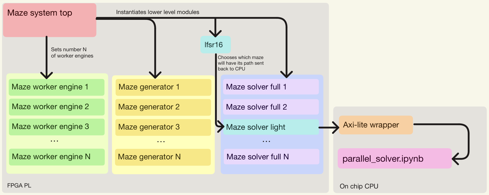

# Extension: Parallel Maze Solving in Hardware

## Overview

This extension explores the limits of our maze-running system in a theoretical setting where the maze changes in real time. Instead of recomputing a single solution after each change — which would introduce latency — we take an AI-inspired approach by solving many possible maze configurations **in parallel in hardware** using the **BFS (Breadth-First Search) algorithm**.

The architecture achieves parallelism by instantiating multiple independent `maze_worker_engine` modules within a `generate` loop in `maze_system_top`. Each engine has its own registers, FSMs, and memory. This is fundamentally different from a `for` loop (which only describes behaviour inside already-existing hardware): in FPGA design each generated instance maps to **physically separate logic resources** (LUTs, registers, BRAM), so all engines execute simultaneously rather than time-sharing a single processor.

## Architecture



### Why Two Solvers? (Light vs Full)

When running thousands of mazes in parallel on an FPGA, transferring every grid and its full path solution back to the CPU would create massive on-chip data congestion and heavy latency. To avoid this bottleneck, the design uses two types of solvers:

- **`maze_solver_light_10x10`** (Light solver) — Performs BFS and outputs only `valid` and `path_len`. It does **not** reconstruct or transmit the actual path. Its purpose is purely to benchmark the raw computation speed of the Programmable Logic (PL): every worker engine runs this solver, proving the FPGA can generate and solve all mazes at full throughput.

- **`maze_solver_full_10x10`** (Full solver) — Performs BFS **and** full path reconstruction, outputting the step-by-step directions packed into 7×32-bit words. This solver is activated for exactly **one** randomly chosen maze (the "target"), selected by the `lfsr16` PRNG at the start of a run. Only that target maze has its grid and path sent back to the CPU.

This strategy lets us verify that the entire system works correctly — the target maze provides a complete, inspectable result with grid layout and solved path — while avoiding the impossible task of retrieving data for every single maze. The light solver handles the bulk workload; the full solver handles the verification sample.

### Module Descriptions

| Module | File | Role |
|---|---|---|
| **`lfsr16`** | `lfsr16.sv` | 16-bit Linear Feedback Shift Register (taps 16, 14, 13, 11). Produces pseudo-random numbers used for maze generation and target-ID selection. |
| **`maze_generator_10x10`** | `maze_generator_10x10.sv` | Generates a random 10×10 maze represented as a 100-bit grid (packed into 4×32-bit words). It first carves a guaranteed path from (0,0) to (9,9) by randomly stepping right or down, then fills the remaining cells probabilistically, ensuring both endpoints are always open. |
| **`maze_solver_light_10x10`** | `maze_solver_light_10x10.sv` | Lightweight BFS solver. Outputs only `valid` (path exists) and `path_len` (shortest-path length). Used by all non-target workers to benchmark PL computation speed without data transfer overhead. |
| **`maze_solver_full_10x10`** | `maze_solver_full_10x10.sv` | Full BFS solver with path reconstruction. Stores parent directions, backtracks from cell 99 to cell 0, and packs the result into 7×32-bit path words (2 bits per step). Activated only for the randomly selected target maze. |
| **`maze_worker_engine`** | `maze_worker_engine.sv` | Self-contained pipeline that generates a maze, then solves it. For non-target mazes it runs only the light solver; for the target maze it runs **both** solvers in parallel so the full path is available. |
| **`maze_system_top`** | `maze_system_top.sv` | Top-level controller, parameterised by `NUM_ENGINES` and `TOTAL_MAZES`. On `start_run`: (1) picks a random target ID via the LFSR, (2) dispatches maze IDs to idle engines one per cycle, (3) collects results into memory, and (4) captures the full path and grid of the target maze. Asserts `run_done` when all mazes are complete. |
| **`maze_system_wrapper`** | `maze_system_wrapper.sv` | Thin wrapper that instantiates `maze_system_top` with fixed parameters (8 engines, 10 000 mazes) and exposes an AXI4-Lite interface for CPU communication. |

### How the Parallelism Works

1. `maze_system_top` contains a **`generate` block** that creates `NUM_ENGINES` independent `maze_worker_engine` instances.
2. The top-level FSM acts as a **dispatcher**: it maintains a `next_maze_id` counter and, every clock cycle, assigns the next maze ID to the first idle engine.
3. Each engine runs its full generate → solve pipeline **independently and concurrently** with all other engines.
4. When an engine finishes, its `done` signal is collected by the top FSM, the result is stored, and the engine becomes available for a new maze.
5. This continues until all `TOTAL_MAZES` have been completed.

## Grid Encoding

The 10×10 maze grid (100 cells) is stored as a 128-bit flat vector, split across four 32-bit words:

| Word | Bits | Cells |
|---|---|---|
| `grid0` | `[31:0]` | cells 0–31 |
| `grid1` | `[63:32]` | cells 32–63 |
| `grid2` | `[95:64]` | cells 64–95 |
| `grid3` | `[127:96]` | cells 96–99 (bits 100–127 unused) |

- Cell index = `row * 10 + col` (row-major order).
- `1` = open (passable), `0` = wall.
- Cell 0 = start `(0,0)`, Cell 99 = target `(9,9)`.

## Path Encoding

The full solver encodes the solution as a sequence of 2-bit direction steps, packed into 7×32-bit words (224 bits total, supporting up to 112 steps):

| Encoding | Direction |
|---|---|
| `2'b00` | UP |
| `2'b01` | DOWN |
| `2'b10` | LEFT |
| `2'b11` | RIGHT |

Steps are packed LSB-first: step 0 occupies bits `[1:0]` of `path_word0`, step 1 occupies `[3:2]`, and so on.

## Prerequisites

- **Verilator** (tested with v5.038). Install via Homebrew:
  ```bash
  brew install verilator
  ```

## Running the Testbenches

All scripts are located in the `maze_gen_solve/` directory.

### Run All Tests at Once

```bash
cd maze_gen_solve
chmod +x *.sh
./run_all_tests.sh
```

This executes the six testbenches in order, bottom-up from the lowest-level module to the full system.

### Run Individual Tests

| Script | Testbench | What it tests |
|---|---|---|
| `./run_tb_lfsr16.sh` | `tb_lfsr16` | LFSR produces non-zero, changing pseudo-random values |
| `./run_tb_solver_light.sh` | `tb_maze_solver_light_10x10` | Light BFS: all-open maze → valid, `path_len = 18`; blocked maze → invalid |
| `./run_tb_solver_full.sh` | `tb_maze_solver_full_10x10` | Full BFS: all-open maze → valid, `path_len = 18`, path words populated |
| `./run_tb_generator.sh` | `tb_maze_generator_10x10` | Generator produces a grid; light solver confirms it is always solvable |
| `./run_tb_worker.sh` | `tb_maze_worker_engine` | Worker engine: non-target maze → light-only; target maze → both solvers, full path available |
| `./run_tb_top.sh` | `tb_maze_system_top` | Full system (2 engines, 8 mazes): dispatches, solves, prints target maze and path |

Each script compiles the required modules with Verilator (`--binary`) then immediately runs the resulting simulation.

## Testbench Output Explained

### 1. `tb_lfsr16`

```
time=55000 value=2469
time=65000 value=48d2
...
tb_lfsr16 finished
```

Prints 20 consecutive LFSR output values (hexadecimal) after loading seed `0x1234`. Each value should differ from the previous, confirming the PRNG is shifting correctly. The sequence is deterministic for a given seed.

### 2. `tb_maze_solver_light_10x10`

```
LIGHT TEST 1: valid=1 path_len=18
LIGHT TEST 2: valid=0 path_len=0
```

- **Test 1 (all-open maze):** Every cell is passable. The shortest BFS path from (0,0) to (9,9) on a fully open 10×10 grid is 18 steps (9 right + 9 down). `valid=1` confirms a path was found, `path_len=18` confirms the correct shortest distance.
- **Test 2 (blocked maze):** Only cell 0 is open; the target is unreachable. `valid=0` confirms no path exists.

### 3. `tb_maze_solver_full_10x10`

```
FULL TEST: valid=1 path_len=18
path_word0=fffd5555
path_word1=0000000f
...
```

Same all-open maze as light test 1. Additionally prints the 7 path words encoding the step-by-step directions. The bit pattern `0x...5555` corresponds to alternating RIGHT (`11`) and DOWN (`01`) moves — a valid shortest path on an open grid.

### 4. `tb_maze_generator_10x10`

```
GENERATOR DONE
grid0=b7a5e01f  grid1=dfb1ec08  grid2=0a1ef021  grid3=00000008
GEN->SOLVE: valid=1 path_len=18
```

The generator produces a random maze (grid values depend on the seed `0x55AA`). The light solver is then run on the generated grid and confirms `valid=1` — every generated maze is guaranteed solvable because the generator always carves a path from start to target before adding random walls.

### 5. `tb_maze_worker_engine`

```
WORKER TEST 1: maze_id=2 done_maze_id=2 solved=1 len=18 target_valid=0
WORKER TEST 2: maze_id=7 done_maze_id=7 solved=1 len=18 target_valid=1 target_len=18
```

- **Test 1 (non-target):** `maze_id=2`, `target_id=5` → not the target. Only the light solver runs. `solved=1` and `target_valid=0` (no full path computed).
- **Test 2 (target):** `maze_id=7`, `target_id=7` → this is the target. Both solvers run. `solved=1` and `target_valid=1` with `target_len=18` (full path available).

### 6. `tb_maze_system_top`

This is the integration test for the full system, configured with **2 engines** and **8 mazes**.

```
cycles=1000 state=1 next_maze_id=6 completed_count=4 run_done=0 target_id=1 busy0=1 done0=0
```

**Progress report** (printed every 1000 cycles): shows the FSM state (`1` = `T_RUN`), how many mazes have been dispatched, how many completed, and engine status. This lets you monitor that the system is making forward progress.

```
TOP TEST DONE
target_id=1
target_valid=1 target_path_len=18
target_path_word0=f75ddf57  ...
```

**Final results:** the randomly selected target maze ID, whether a valid path was found, the path length, and the raw path words.

```
TARGET MAZE (10x10)
-------------------
S . . # # # # # # #
# . # # # # . # # #
. . . . # # . # # #
...
```

**ASCII maze visualisation:** `S` = start (0,0), `T` = target (9,9), `.` = open cell, `#` = wall.

```
PATH (18 steps)
----------------
0 : RIGHT
1 : DOWN
2 : DOWN
...
```

**Decoded path:** each step number and its direction (UP/DOWN/LEFT/RIGHT), derived from the 2-bit encoding in the path words.

```
TARGET MAZE WITH PATH
---------------------
S * . # # # # # # #
# * # # # # . # # #
. * . . # # . # # #
. * * * # # # # # .
. . # * * # # # # .
...
```

**Maze overlay with solution path:** `*` marks cells on the shortest path, making it easy to visually verify that the BFS solution is correct and connects `S` to `T` without crossing walls.